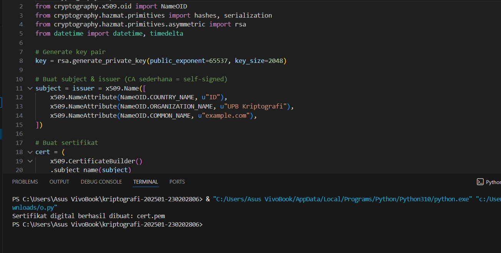

# Laporan Praktikum Kriptografi
Minggu ke-: 10  
Topik: Public Key Infrastructure (PKI & Certificate Authority

Nama: Exca Mutiara Nabilla  
NIM: 230202806 

Kelas: 5ikra  

---

## 1. Tujuan
Membuat sertifikat digital sederhana.
Menjelaskan peran Certificate Authority (CA) dalam sistem PKI.
Mengevaluasi fungsi PKI dalam komunikasi aman (contoh: HTTPS, TLS).

---

## 2. Dasar Teori
Public Key Infrastructure (PKI) adalah sebuah sistem yang mengelola pembuatan, distribusi, penyimpanan, dan pencabutan public key serta sertifikat digital. PKI memungkinkan proses kriptografi kunci publik berjalan aman melalui penggunaan pasangan kunci (public–private key) untuk enkripsi, tanda tangan digital, dan autentikasi. Dengan adanya PKI, identitas pengguna atau server dapat diverifikasi sehingga komunikasi di jaringan, terutama jaringan publik seperti internet, bisa dilakukan secara aman.

Certificate Authority (CA) merupakan lembaga tepercaya dalam PKI yang bertugas menerbitkan dan menandatangani sertifikat digital. Sertifikat ini berfungsi mengaitkan public key dengan identitas pemiliknya, misalnya domain website, organisasi, atau individu. CA berperan memastikan bahwa pihak yang meminta sertifikat benar-benar valid, sehingga pengguna lain dapat mempercayai public key yang tercantum di sertifikat tersebut.

Secara keseluruhan, PKI dan CA bekerja sama untuk menciptakan ekosistem keamanan yang memastikan kerahasiaan data, integritas pesan, dan autentikasi identitas. Tanpa PKI dan CA, komunikasi digital seperti HTTPS, email terenkripsi, dan tanda tangan digital tidak dapat dipercaya karena tidak ada otoritas yang menjamin kebenaran identitas pemilik public key.

---

## 3. Alat dan Bahan
(- Python 3.x  
- Visual Studio Code / editor lain  
- Git dan akun GitHub  
- Library tambahan (misalnya pycryptodome, jika diperlukan)  )

---

## 4. Source Code

```python
from cryptography import x509
from cryptography.x509.oid import NameOID
from cryptography.hazmat.primitives import hashes, serialization
from cryptography.hazmat.primitives.asymmetric import rsa
from datetime import datetime, timedelta

# Generate key pair
key = rsa.generate_private_key(public_exponent=65537, key_size=2048)

# Buat subject & issuer (CA sederhana = self-signed)
subject = issuer = x509.Name([
    x509.NameAttribute(NameOID.COUNTRY_NAME, u"ID"),
    x509.NameAttribute(NameOID.ORGANIZATION_NAME, u"UPB Kriptografi"),
    x509.NameAttribute(NameOID.COMMON_NAME, u"example.com"),
])

# Buat sertifikat
cert = (
    x509.CertificateBuilder()
    .subject_name(subject)
    .issuer_name(issuer)
    .public_key(key.public_key())
    .serial_number(x509.random_serial_number())
    .not_valid_before(datetime.utcnow())
    .not_valid_after(datetime.utcnow() + timedelta(days=365))
    .sign(key, hashes.SHA256())
)

# Simpan sertifikat
with open("cert.pem", "wb") as f:
    f.write(cert.public_bytes(serialization.Encoding.PEM))

print("Sertifikat digital berhasil dibuat: cert.pem")
```
)

---

## 5. Hasil dan Pembahasan
Hasil eksekusi program Caesar Cipher:



---
## 6. Analisis 
1. Bagaimana browser memverifikasi sertifikat HTTPS?
Ketika pengguna mengakses situs HTTPS, browser menerima sertifikat digital dari server. Browser kemudian memeriksa apakah sertifikat tersebut ditandatangani oleh CA yang dipercaya (tersimpan di trusted root store bawaan browser/OS). Selanjutnya browser memverifikasi keaslian tanda tangan digital CA, memeriksa validitas waktu, kesesuaian domain, dan memastikan sertifikat belum dicabut melalui CRL atau OCSP. Jika semua valid, browser membuat koneksi TLS aman menggunakan public key dalam sertifikat, sehingga komunikasi terenkripsi dan autentik.

2. Apa yang terjadi jika CA palsu menerbitkan sertifikat?
Jika CA palsu atau CA yang diretas berhasil menerbitkan sertifikat untuk domain tertentu, penyerang dapat melakukan man-in-the-middle attack (MITM) dengan menyamar sebagai situs asli. Browser akan menganggap sertifikat tersebut valid jika CA tersebut ada dalam daftar CA tepercaya. Kasus nyata: pada 2011, CA DigiNotar diretas dan sertifikat palsu untuk domain Google diterbitkan, memungkinkan penyadapan besar-besaran. Akibatnya, CA tersebut dicabut dari seluruh browser dan akhirnya bangkrut. Artinya, keamanan PKI sangat bergantung pada integritas CA.

3. Mengapa PKI penting dalam komunikasi aman (misalnya transaksi online)?
PKI memastikan tiga aspek utama keamanan:
- Autentikasi: pengguna yakin bahwa mereka terhubung ke server yang benar, bukan situs palsu.
- Enkripsi: data sensitif seperti password, data kartu kredit, dan informasi pribadi terlindungi selama transmisi.
- Integritas: memastikan data tidak dimodifikasi oleh pihak lain.

Dalam transaksi online, tanpa PKI pengguna tidak dapat membedakan situs asli dan situs phishing, data akan mudah disadap, dan identitas server tidak dapat diverifikasi. Dengan PKI, seluruh proses transaksi digital—mulai dari login, pembayaran, hingga pengiriman data pribadi—menjadi aman dan dapat dipercaya.

## 7. Jawaban Pertanyaan
1. Apa fungsi utama Certificate Authority (CA)?
Fungsi utama CA adalah memverifikasi identitas pemilik public key dan menerbitkan sertifikat digital yang tepercaya. CA bertindak sebagai pihak ketiga yang dipercaya (trusted third party) untuk memastikan bahwa public key benar-benar milik domain, organisasi, atau individu yang mengklaimnya. Selain itu, CA juga bertanggung jawab untuk menandatangani, mengelola, dan mencabut sertifikat melalui mekanisme CRL dan OCSP.

2. Mengapa self-signed certificate tidak cukup untuk sistem produksi?
Self-signed certificate tidak ditandatangani oleh CA tepercaya, sehingga browser atau client tidak dapat memverifikasi identitas server. Akibatnya akan muncul peringatan "Connection Not Secure". Dalam sistem produksi, ini berbahaya karena:
Pengguna bisa ditipu oleh penyerang (MITM) yang membuat sertifikat palsu sendiri.
Tidak ada proses verifikasi identitas pihak yang menggunakan sertifikat.
Tidak dapat diandalkan untuk publik karena tidak masuk ke trusted root store browser.
Self-signed certificate hanya cocok untuk uji coba lokal, bukan layanan publik.

3. 3. Bagaimana PKI mencegah serangan MITM dalam komunikasi TLS/HTTPS?
PKI mencegah MITM dengan cara memastikan bahwa public key server divalidasi oleh CA tepercaya. Ketika pengguna mengakses situs HTTPS, browser memverifikasi tanda tangan digital CA pada sertifikat. Jika penyerang mencoba menyisipkan dirinya dengan sertifikat palsu, browser akan mendeteksi bahwa sertifikat tersebut tidak ditandatangani oleh CA yang valid, sehingga koneksi diblokir. Dengan demikian, PKI memastikan bahwa client hanya akan melakukan negosiasi kunci rahasia (handshake TLS) dengan server yang autentik, bukan dengan penyerang.
)
---

## 7. Kesimpulan
Berdasarkan percobaan, dapat disimpulkan bahwa PKI dan Certificate Authority berperan penting dalam memvalidasi identitas server dan memastikan koneksi HTTPS berjalan aman. Verifikasi sertifikat oleh browser terbukti mampu mencegah serangan MITM ketika sertifikat tidak valid atau tidak dipercaya. Dengan demikian, keberadaan CA tepercaya menjadi kunci utama terciptanya komunikasi terenkripsi yang aman dan terjamin integritasnya.

---

## 8. Commit Log
Contoh:
```
commit week 10
Author: exca mutiara nabilla <excaamn@gmail.com>
Date:   2025-12-12

    week2-cryptosystem: implementasi Caesar Cipher dan laporan )
```
