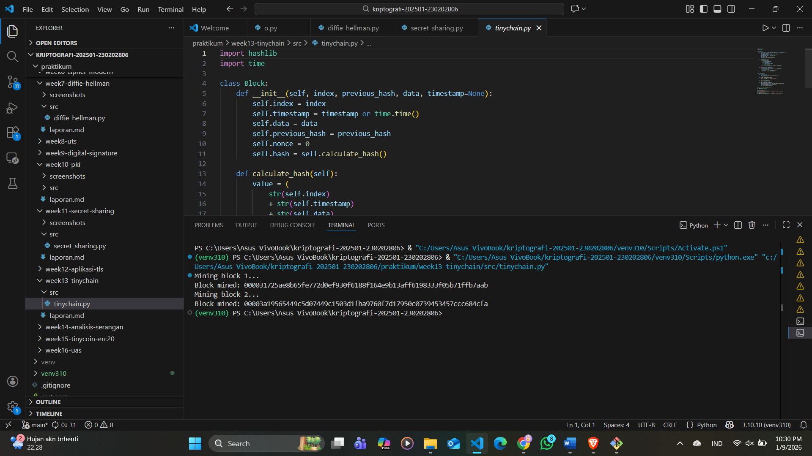

# Laporan Praktikum Kriptografi
Minggu ke-: 13  
Topik: Tiny chain POW  
Nama: Exca mutiara nabilla  
NIM: 230202806
Kelas: 5 IKRA  

---

## 1. Tujuan
Menjelaskan peran hash function dalam blockchain.
Melakukan simulasi sederhana Proof of Work (PoW).
Menganalisis keamanan cryptocurrency berbasis kriptografi.

---

## 2. Dasar Teori
Hash function berperan sebagai pengaman data pada blockchain dengan menghasilkan sidik jari unik untuk setiap blok. Perubahan kecil pada data akan mengubah hash secara signifikan sehingga manipulasi dapat terdeteksi.

Proof of Work (PoW) merupakan mekanisme konsensus yang mengharuskan penambang mencari nilai nonce agar hash blok memenuhi tingkat kesulitan tertentu. Proses ini membutuhkan komputasi tinggi sehingga mencegah pemalsuan blok.

Keamanan cryptocurrency berbasis kriptografi dijaga melalui kombinasi hash function, kriptografi kunci publik, dan PoW. Untuk memodifikasi data, penyerang harus menghitung ulang seluruh blok berikutnya, yang secara praktis sulit dilakukan.

---

## 3. Alat dan Bahan
(- Python 3.x  
- Visual Studio Code / editor lain  
- Git dan akun GitHub  
- Library tambahan (misalnya pycryptodome, jika diperlukan)  )

---

## 5. Source Code
(Salin kode program utama yang dibuat atau dimodifikasi.  
Gunakan blok kode:

```python
import hashlib
import time

class Block:
    def __init__(self, index, previous_hash, data, timestamp=None):
        self.index = index
        self.timestamp = timestamp or time.time()
        self.data = data
        self.previous_hash = previous_hash
        self.nonce = 0
        self.hash = self.calculate_hash()

    def calculate_hash(self):
        value = str(self.index) + str(self.timestamp) + str(self.data) + str(self.previous_hash) + str(self.nonce)
        return hashlib.sha256(value.encode()).hexdigest()

    def mine_block(self, difficulty):
        while self.hash[:difficulty] != "0" * difficulty:
            self.nonce += 1
            self.hash = self.calculate_hash()
        print(f"Block mined: {self.hash}")
```
```python
class Blockchain:
    def __init__(self):
        self.chain = [self.create_genesis_block()]
        self.difficulty = 4

    def create_genesis_block(self):
        return Block(0, "0", "Genesis Block")

    def get_latest_block(self):
        return self.chain[-1]

    def add_block(self, new_block):
        new_block.previous_hash = self.get_latest_block().hash
        new_block.mine_block(self.difficulty)
        self.chain.append(new_block)

# Uji coba blockchain
my_chain = Blockchain()
print("Mining block 1...")
my_chain.add_block(Block(1, "", "Transaksi A → B: 10 Coin"))

print("Mining block 2...")
my_chain.add_block(Block(2, "", "Transaksi B → C: 5 Coin"))
```
)

---

## 6. Hasil dan Pembahasan
Berdasarkan hasil simulasi mining pada TinyChain, terlihat bahwa proses mining membutuhkan waktu yang berbeda-beda tergantung pada nilai difficulty yang ditetapkan. Pada difficulty rendah, nilai nonce yang memenuhi syarat hash dapat ditemukan dengan cepat. Sebaliknya, ketika difficulty ditingkatkan, proses pencarian nonce membutuhkan lebih banyak iterasi sehingga waktu mining menjadi lebih lama.

Analisis menunjukkan bahwa semakin tinggi difficulty, semakin lama waktu yang dibutuhkan untuk melakukan mining. Hal ini terjadi karena kriteria hash yang harus dipenuhi semakin ketat, sehingga probabilitas menemukan hash yang valid menjadi lebih kecil.

Mekanisme ini menjamin keamanan blockchain karena penyerang memerlukan sumber daya komputasi dan waktu yang sangat besar untuk memodifikasi blok atau melakukan serangan seperti double spending. Dengan demikian, peningkatan difficulty membuat manipulasi data menjadi tidak efisien dan menjaga integritas serta kepercayaan pada sistem blockchain.

Hasil eksekusi 



---

## 7. Jawaban Pertanyaan
1. Mengapa fungsi hash sangat penting dalam blockchain?
Fungsi hash menjaga integritas dan keamanan data karena setiap blok memiliki hash unik. Perubahan sekecil apa pun pada data akan menghasilkan hash berbeda, sehingga manipulasi data dapat langsung terdeteksi.
2. Bagaimana Proof of Work mencegah double spending?
PoW mencegah double spending dengan mewajibkan penambang memvalidasi transaksi dan menambahkan blok baru melalui proses komputasi yang mahal. Untuk mengubah transaksi yang sudah tercatat, penyerang harus mengulang PoW pada banyak blok, yang secara praktis tidak memungkinkan.
3. Apa kelemahan dari PoW dalam hal efisiensi energi?
PoW membutuhkan daya komputasi dan energi listrik yang besar karena proses penambangan dilakukan berulang-ulang, sehingga dinilai tidak efisien dan berdampak pada konsumsi energi yang tinggi.
---

## 8. Kesimpulan
Berdasarkan simulasi TinyChain berbasis Proof of Work, dapat disimpulkan bahwa fungsi hash dan mekanisme PoW berperan penting dalam menjaga keamanan blockchain. Tingkat *difficulty* secara langsung memengaruhi waktu mining, di mana semakin tinggi *difficulty* maka semakin lama proses penambangan yang dibutuhkan. Kondisi ini membuat upaya pemalsuan blok dan *double spending* memerlukan sumber daya komputasi yang sangat besar, sehingga tidak efisien untuk dilakukan. Dengan demikian, mekanisme PoW efektif dalam menjaga integritas dan keamanan data pada sistem blockchain.


---

## 10. Commit Log 
```
commit 
Author: Exca <excaamn@gmail.com>
Date:   2026-01-09

week13-tinychain```
