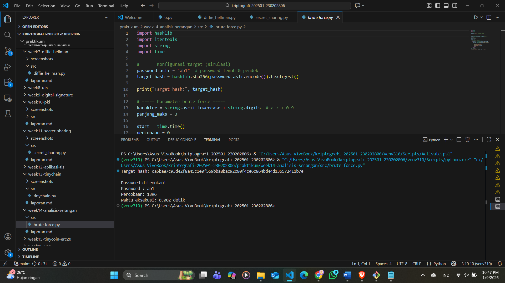

# Laporan Praktikum Kriptografi
Minggu ke-: 14  
Topik: analisis serangan 
Nama: Exca mutiara nabilla
NIM: 230202806
Kelas: 5ikra  

---

## 1. Tujuan
Mengidentifikasi jenis serangan pada sistem informasi nyata.
Mengevaluasi kelemahan algoritma kriptografi yang digunakan.
Memberikan rekomendasi algoritma kriptografi yang sesuai untuk perbaikan keamanan.

---

## 2. Dasar Teori
Kriptografi merupakan teknik untuk melindungi informasi agar hanya pihak yang berwenang yang dapat mengaksesnya. Dalam sistem informasi modern, kriptografi digunakan untuk menjaga kerahasiaan, integritas, dan autentikasi data melalui algoritma seperti fungsi hash, kriptografi kunci simetris dan asimetris. Keamanan sistem tidak hanya bergantung pada kekuatan algoritma, tetapi juga pada cara algoritma tersebut diimplementasikan dan dikonfigurasikan.

Berbagai serangan kriptografi, seperti brute force, Man-in-the-Middle (MITM), dan replay attack, umumnya terjadi akibat penggunaan algoritma yang sudah usang atau konfigurasi keamanan yang lemah. Contohnya, penggunaan MD5 atau SHA-1 untuk penyimpanan password rentan terhadap serangan karena algoritma tersebut cepat dan tidak dirancang untuk hashing password. Demikian pula, penggunaan protokol TLS versi lama membuka peluang penyadapan komunikasi.
---

## 3. Alat dan Bahan
(- Python 3.x  
- Visual Studio Code / editor lain  
- Git dan akun GitHub  
- Library tambahan (misalnya pycryptodome, jika diperlukan)  )

---

## 4. Source Code
(Salin kode program utama yang dibuat atau dimodifikasi.  
Gunakan blok kode:

```python
# contoh potongan kode
def encrypt(text, key):
    return ...
```
)

---

## 5. Hasil dan Pembahasan
Pada tahun 2012, LinkedIn mengalami kebocoran data yang mengakibatkan lebih dari 6 juta password pengguna tersebar di internet. Password tersebut disimpan menggunakan algoritma hash SHA-1 tanpa salt, sehingga mudah untuk di-crack menggunakan teknik rainbow table dan brute force.
a. Vektor serangan: Akses ilegal ke database pengguna
b. Penyebab kelemahan:
- Hash password tanpa salt
- Menggunakan algoritma hash yang sudah tidak direkomendasikan
- Tidak ada rate limiting atau perlindungan tambahan

kelemahan algoritma : SHA-1 dirancang untuk integritas data, bukan untuk penyimpanan password. Algoritma ini cepat secara komputasi sehingga memungkinkan penyerang melakukan jutaan percobaan hash per detik menggunakan GPU, membuat brute force menjadi sangat efektif.

Kelemahan bukan pada konsep kriptografi, melainkan pada:
Pemilihan algoritma yang tidak tepat
Implementasi yang buruk
Konfigurasi keamanan yang lemah

| Sistem Lama | Sistem Aman                  |
| ----------- | ---------------------------- |
| SHA-1 / MD5 | **bcrypt / scrypt / Argon2** |
| Tanpa salt  | Salt unik per user           |
| Hash cepat  | Hash lambat & memory-hard    |

alasan pemilihan algoritma : 
- bcrypt: Memperlambat brute force dengan cost factor
- scrypt: Tahan terhadap serangan GPU
- Argon2: Pemenang Password Hashing Competition (PHC), paling aman saat ini

  dampak :
  Serangan brute force menjadi jauh lebih mahal dan lambat
Kebocoran database tidak langsung membocorkan password
Meningkatkan perlindungan akun pengguna secara signifikan

MD5 → SHA-256: MD5 rentan collision
RSA 1024-bit → ECC (Curve25519): Keamanan lebih tinggi dengan ukuran kunci lebih kecil
TLS lama → TLS 1.3: Menghilangkan cipher lemah dan MITM

Hasil eksekusi program 


)

---

## 6. Jawaban Pertanyaan
1. Mengapa banyak sistem lama masih rentan terhadap brute force atau dictionary attack?
Banyak sistem lama menggunakan password lemah, algoritma hash cepat (seperti MD5 atau SHA-1), serta tidak menerapkan salt dan rate limiting. Kondisi ini memungkinkan penyerang mencoba banyak kombinasi password dalam waktu singkat menggunakan komputasi modern.
2. Apa bedanya kelemahan algoritma dengan kelemahan implementasi?
Kelemahan algoritma terjadi ketika algoritma kriptografi itu sendiri sudah terbukti tidak aman secara matematis. Sementara itu, kelemahan implementasi terjadi ketika algoritma yang sebenarnya kuat digunakan secara keliru, misalnya tanpa salt, kunci terlalu pendek, atau konfigurasi sistem yang salah.
3. Bagaimana organisasi dapat memastikan sistem kriptografi mereka tetap aman di masa depan?
Organisasi perlu menerapkan algoritma modern, memperbarui sistem secara berkala, melakukan audit keamanan, serta mengikuti standar dan rekomendasi kriptografi terbaru. Selain itu, penerapan kebijakan keamanan yang baik dan pelatihan sumber daya manusia juga penting untuk mengurangi kesalahan implementasi.
---

## 7. Kesimpulan
Sistem kriptografi yang tidak diperbarui rentan terhadap serangan seperti brute force dan dictionary attack, terutama akibat penggunaan algoritma usang, password lemah, serta konfigurasi dan implementasi yang tidak tepat. Perbedaan antara kelemahan algoritma dan kelemahan implementasi menunjukkan bahwa keamanan tidak hanya ditentukan oleh kekuatan algoritma, tetapi juga oleh cara penerapannya. Oleh karena itu, organisasi perlu menerapkan algoritma kriptografi modern, melakukan pembaruan dan audit keamanan secara berkala, serta memastikan konfigurasi sistem yang benar agar keamanan sistem tetap terjaga di masa depan.

---
---

## 8. Commit Log
Contoh:
```
commit 
Author: exca<excaamn@gmail.com>
Date:   2026-01-09

week14-analisis-serangan```
