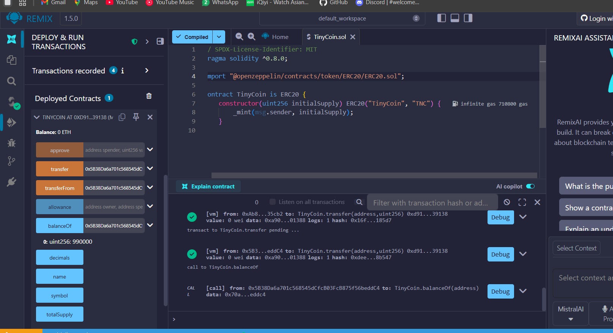

# Laporan Praktikum Kriptografi
Minggu ke-: 15  
Topik: Tinycoin  
Nama: Exca mutiara nabilla  
NIM: 230202806
Kelas: 5ikra  

---

## 1. Tujuan
Mengembangkan proyek sederhana berbasis algoritma kriptografi.
Mendokumentasikan proses implementasi proyek ke dalam repository Git.
Menyusun laporan teknis hasil proyek akhir.

---

## 2. Dasar Teori
ERC-20 merupakan standar token pada blockchain Ethereum yang mendefinisikan sekumpulan fungsi dan event agar token dapat berinteraksi secara konsisten dengan wallet, exchange, dan smart contract lain. Standar ini memastikan token memiliki mekanisme dasar seperti pengecekan saldo, transfer token, dan persetujuan penggunaan token oleh pihak ketiga (allowance).

---

## 3. Alat dan Bahan
(- Python 3.x  
- Visual Studio Code / editor lain  
- Git dan akun GitHub  
- Library tambahan (misalnya pycryptodome, jika diperlukan)  )

---

## 4. Source Code
(Salin kode program utama yang dibuat atau dimodifikasi.  
Gunakan blok kode:

```python
// SPDX-License-Identifier: MIT
pragma solidity ^0.8.0;

import "@openzeppelin/contracts/token/ERC20/ERC20.sol";

contract TinyCoin is ERC20 {
    constructor(uint256 initialSupply) ERC20("TinyCoin", "TNC") {
        _mint(msg.sender, initialSupply);
    }
}
```
)

---

## 5. Hasil dan Pembahasan
smart contract TinyCoin berhasil dikembangkan dan dikompilasi menggunakan Remix IDE tanpa error pada Solidity Compiler. Kontrak kemudian dideploy ke jaringan JavaScript VM (atau testnet Ethereum), dan sistem menghasilkan alamat kontrak unik sebagai identitas TinyCoin di blockchain. Keberhasilan deployment menunjukkan bahwa struktur kontrak ERC-20 telah sesuai dengan standar dan siap digunakan.
pengujian fungsi balanceOf(address) menunjukkan bahwa saldo awal token telah dialokasikan dengan benar kepada alamat pemilik kontrak sesuai nilai total supply yang ditentukan. Selanjutnya, pengujian fungsi transfer(address, amount) berhasil memindahkan token dari satu alamat ke alamat lain, dengan saldo pengirim berkurang dan saldo penerima bertambah sesuai jumlah transfer.

Hasil pengujian juga menunjukkan bahwa nilai total supply tetap konsisten setelah transaksi dilakukan. Hal ini membuktikan bahwa mekanisme transfer pada kontrak ERC-20 tidak menciptakan atau menghilangkan token secara tidak sah, sehingga menjaga integritas dan keandalan sistem TinyCoin.


Hasil eksekusi



---

## 6. Jawaban Pertanyaan
1. Apa fungsi utama ERC-20 dalam ekosistem blockchain?
ERC-20 berfungsi sebagai standar token pada blockchain Ethereum yang memastikan interoperabilitas antar token, wallet, dan aplikasi terdesentralisasi (dApp). Dengan standar ini, token dapat digunakan dan diperdagangkan secara konsisten tanpa memerlukan penyesuaian khusus pada sistem lain.
2. Bagaimana mekanisme transfer token bekerja dalam kontrak ERC-20?
Transfer token dilakukan melalui fungsi transfer, di mana kontrak memverifikasi saldo pengirim, mengurangi saldo tersebut, dan menambah saldo penerima. Setiap transaksi harus ditandatangani secara kriptografis oleh pemilik akun, sehingga hanya pemegang private key yang sah yang dapat melakukan transfer.
3. Apa risiko utama dalam implementasi smart contract dan bagaimana cara mitigasinya?
Risiko utama meliputi bug kode, reentrancy attack, dan kesalahan logika kontrak. Mitigasinya dilakukan dengan menggunakan library tepercaya (seperti OpenZeppelin), melakukan code audit, menerapkan testing menyeluruh, serta mengikuti praktik pengembangan smart contract yang aman.
---

## 7. Kesimpulan
Berdasarkan proses deployment dan pengujian TinyCoin berbasis ERC-20, dapat disimpulkan bahwa smart contract berhasil dikompilasi dan dideploy dengan baik ke jaringan Ethereum. Pengujian fungsionalitas menunjukkan bahwa fungsi balanceOf dan transfer berjalan sesuai standar ERC-20, serta nilai total supply tetap konsisten setelah transaksi. Hal ini membuktikan bahwa kontrak TinyCoin telah diimplementasikan dengan benar dan mampu menjaga integritas serta keandalan token dalam ekosistem blockchain.

---

## 8. Commit Log
```
commit week 15
Author: Exca mutiara n <excaamn@gmail.com>
Date:   2026-01-09

week15-tinycoin-erc20
```
