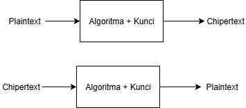
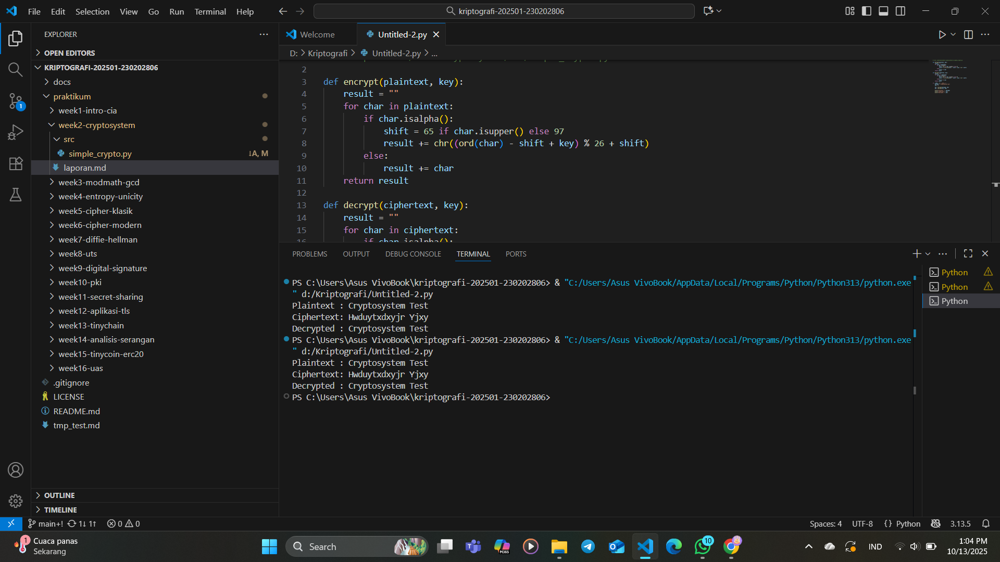

# Laporan Praktikum Kriptografi
Minggu ke-: X  
Topik: [Crypto system]  
Nama: [Exca Mutiara Nabilla]  
NIM: [230202806]  
Kelas: [5 IKRA]  

---

## 1. Tujuan
Mengidentifikasi komponen dasar kriptosistem (plaintext, ciphertext, kunci, algoritma).
Menggambarkan proses enkripsi dan dekripsi sederhana.
Mengklasifikasikan jenis kriptosistem (simetris dan asimetris).

---

## 2. Dasar Teori
Kriptosistem adalah sebuah sistem kriptografi yang terdiri dari serangkaian algoritma untuk menyediakan layanan keamanan seperti kerahasiaan melalui enkripsi dan dekripsi pesan. Secara umum, kriptosistem memiliki tiga komponen utama: algoritma untuk pembangkitan kunci, enkripsi, dan dekripsi. Keamanan sistem sangat bergantung pada keamanan kunci yang digunakan.

---

## 3. Source Code
src/simple_crypto.py

---

## 4. Hasil dan Pembahasan

Hasil eksekusi program:

---

## 5. Klasifikasi Simetris & Asimetris
1. Kriptografi kunci simetris
Juga dikenal sebagai kriptografi kunci privat, kriptografi kunci rahasia, atau enkripsi kunci tunggal, enkripsi kunci simetris hanya menggunakan satu kunci untuk proses enkripsi dan dekripsi. Untuk jenis sistem ini, setiap pengguna harus memiliki akses ke kunci pribadi yang sama. Kunci pribadi dapat dibagikan melalui saluran komunikasi aman yang telah dibuat sebelumnya seperti kurir pribadi atau jalur aman atau, lebih praktisnya, metode pertukaran kunci yang aman seperti perjanjian kunci Diffie-Hellman.  
contoh :
1. Standar Enkripsi Data: Standar Enkripsi Data (DES) dikembangkan oleh IBM pada awal tahun 1970-an, dan meskipun sekarang dianggap rentan terhadap serangan brute force, arsitekturnya tetap sangat berpengaruh di bidang kriptografi modern.
2. Standar Enkripsi Lanjutan: Standar Enkripsi Lanjutan (AES) adalah sandi pertama dan satu-satunya yang dapat diakses publik dan disetujui oleh Badan Keamanan Nasional AS untuk informasi rahasia.

2. Kriptografi kunci asimetris
Dalam enkripsi asimetris, sepasang kunci digunakan: satu kunci rahasia dan satu kunci publik. Untuk alasan ini, algoritma ini juga disebut sebagai algoritma kunci publik. Kriptografi kunci publik dianggap lebih aman daripada teknik enkripsi simetris karena meskipun satu kunci tersedia untuk umum, pesan yang dienkripsi hanya dapat didekripsi dengan kunci pribadi penerima yang dituju.
contoh :
1. RSA: Dinamakan sesuai dengan nama pendirinya—Rivest, Shamier, dan Adleman—pada tahun 1977, algoritma RSA merupakan salah satu sistem kriptografi kunci publik tertua yang digunakan secara luas dan digunakan untuk transmisi data yang aman.
2. ECC: Kriptografi kurva elips adalah bentuk enkripsi asimetris tingkat lanjut yang menggunakan struktur aljabar kurva elips untuk membuat kunci kriptografi yang kuat. 

---

## 6. Kesimpulan
Berdasarkan percobaan yang dilakukan, dapat disimpulkan bahwa kriptosistem terdiri dari beberapa komponen utama, yaitu plaintext, ciphertext, algoritma enkripsi, algoritma dekripsi, dan kunci. Proses enkripsi berfungsi untuk mengamankan data dengan mengubah plaintext menjadi ciphertext, sedangkan dekripsi mengembalikannya ke bentuk semula.

---

## 7. Pertanyaan Diskus

1. Sebutkan komponen utama dalam sebuah kriptosistem.
   Jawab
    Plaintext (Teks Asli)
    Ciphertext (Teks Terenkripsi)
    Algoritma Enkripsi (Encryption Algorithm)
    Algoritma Dekripsi (Decryption Algorithm)
    Kunci (Key)

3. Apa kelebihan dan kelemahan sistem simetris dibandingkan asimetris?
  Jawab
 A. sistem simetris
   kelebihan : Proses enkripsi & dekripsi lebih cepat karena algoritmanya sederhana dan Membutuhkan daya komputasi lebih rendah
   kekurangan : Distribusi kunci sulit, karena pengirim & penerima harus memiliki kunci yang sama dan aman dan Tidak cocok untuk komunikasi antar banyak pihak.
 B. asimetris
   kelebihan : Tidak perlu membagikan kunci rahasia, sehingga lebih aman dalam distribusi kunci dan Cocok untuk tanda tangan digital dan autentikasi.
   kekurangan : Proses enkripsi & dekripsi lebih lambat dan Membutuhkan sumber daya komputasi lebih besar.
5. Mengapa distribusi kunci menjadi masalah utama dalam kriptografi simetris?
   Jawab
   Karena pada kriptografi simetris, pengirim dan penerima harus menggunakan kunci yang sama untuk enkripsi dan dekripsi.
---
