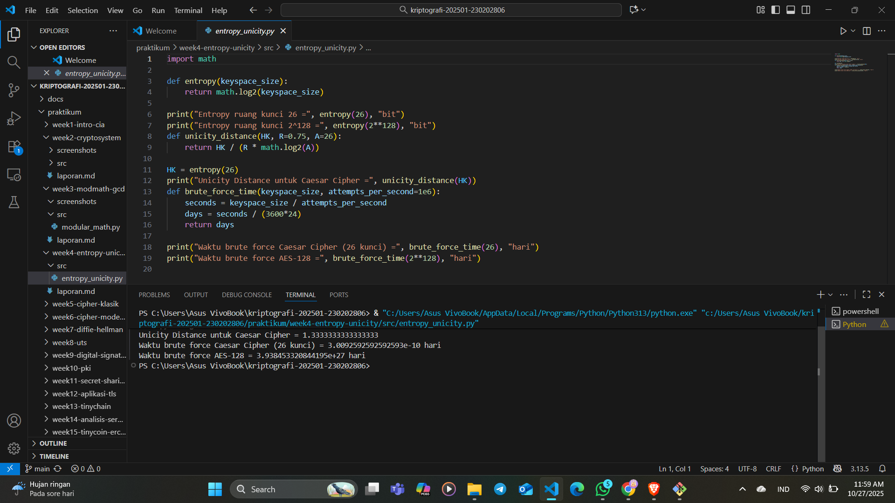

# Laporan Praktikum Kriptografi
Minggu ke-: 4  
Topik: Entropy & Unicity Distance (Evaluasi Kekuatan Kunci dan Brute Force)

Nama: Exca mutiara nabilla

NIM: 230202806 

Kelas: 5 IKRA 

---

## 1. Tujuan
Setelah mengikuti praktikum ini, mahasiswa diharapkan mampu:

Menyelesaikan perhitungan sederhana terkait entropi kunci.
Menggunakan teorema Euler pada contoh perhitungan modular & invers.
Menghitung unicity distance untuk ciphertext tertentu.
Menganalisis kekuatan kunci berdasarkan entropi dan unicity distance.
Mengevaluasi potensi serangan brute force pada kriptosistem sederhana.

---

## 2. Dasar Teori
1. Entropi adalah ukuran derajat ketidakberaturan atau keacakan dari suatu sistem. Dengan kata sederhana, ini adalah cara untuk menentukan seberapa besar ketidakpastian atau kekacauan dalam suatu sistem. Sistem dengan entropi lebih tinggi lebih tidak teratur dan kurang dapat diprediksi.
   Entropi menunjukkan seberapa banyak informasi (dalam bit) yang dibutuhkan untuk menggambarkan suatu kunci.
Entropi sering dihitung menggunakan rumus dari Claude Shannon (1948): H(X)=−i=1∑pi​ log2 ​pi​

- Makna Entropi dalam Kriptografi
a. Jika semua kunci memiliki probabilitas yang sama, maka entropi maksimal.
Misalnya, jika kunci 8 bit bisa memiliki 256 kemungkinan nilai berbeda: H=log2​256=8 bit
b. Entropi rendah berarti kunci mudah ditebak karena tidak cukup acak (misalnya hasil dari kata sandi manusia yang umum digunakan).

Keterkaitan dengan Brute Force

Brute force attack adalah metode mencoba seluruh kemungkinan kunci hingga menemukan kunci yang benar.
Kekuatan kunci terhadap brute force tergantung pada jumlah kemungkinan kunci, yaitu: N=2H
Semakin besar 𝐻, semakin besar jumlah kunci yang harus diuji, dan semakin lama waktu yang dibutuhkan untuk brute force.

2. Unicity Distance (UD) adalah jumlah minimum ciphertext yang diperlukan agar hanya ada satu kemungkinan kunci yang konsisten dengan pesan terenkripsi tersebut.
Dengan kata lain, Unicity Distance mengukur seberapa banyak data yang dibutuhkan agar enkripsi dapat dipecahkan secara teoretis menggunakan analisis statistik.

Diperkenalkan oleh Claude Shannon, Unicity Distance dirumuskan sebagai: U=H(K) / R
di mana:
𝑈 = Unicity Distance (biasanya dalam satuan karakter atau bit pesan)
H(K) = entropi kunci (jumlah informasi dalam kunci)
𝑅 = redundansi pesan (informasi berlebih per karakter dalam plaintext)​

| Algoritma | Panjang Kunci | Entropi (bit) | Keamanan Brute Force              | Unicity Distance (Perkiraan) |
| --------- | ------------- | ------------- | --------------------------------- | ---------------------------- |
| DES       | 56            | 56            | Tidak aman (bisa diretas <1 hari) | Rendah                       |
| 3DES      | 112           | 112           | Aman terbatas                     | Sedang                       |
| AES-128   | 128           | 128           | Sangat aman                       | Tinggi                       |
| AES-256   | 256           | 256           | Sangat aman                       | Sangat tinggi                |


---

## 3. Source Code

```
import math

def entropy(keyspace_size):
    return math.log2(keyspace_size)

print("Entropy ruang kunci 26 =", entropy(26), "bit")
print("Entropy ruang kunci 2^128 =", entropy(2**128), "bit")
```
```
def unicity_distance(HK, R=0.75, A=26):
    return HK / (R * math.log2(A))

HK = entropy(26)
print("Unicity Distance untuk Caesar Cipher =", unicity_distance(HK))
```
```
def brute_force_time(keyspace_size, attempts_per_second=1e6):
    seconds = keyspace_size / attempts_per_second
    days = seconds / (3600*24)
    return days

print("Waktu brute force Caesar Cipher (26 kunci) =", brute_force_time(26), "hari")
print("Waktu brute force AES-128 =", brute_force_time(2**128), "hari")
```

---

Hasil eksekusi program



)

---

## 4. Jawaban Pertanyaan
1. Apa arti dari nilai entropy dalam konteks kekuatan kunci?
   Nilai entropy menunjukkan tingkat keacakan dan ketidakpastian kunci. Semakin tinggi entropi, semakin besar ruang pencarian kunci dan semakin kuat kunci terhadap serangan brute force. Entropi rendah menandakan kunci mudah ditebak karena mengandung pola tertentu.
2. Mengapa unicity distance penting dalam menentukan keamanan suatu cipher?
    Unicity distance menentukan jumlah minimum ciphertext yang dibutuhkan untuk menemukan satu kunci yang benar. Semakin besar nilainya, semakin sulit cipher dipecahkan secara teoretis karena memerlukan lebih banyak data terenkripsi untuk dianalisis.
3. Mengapa brute force masih menjadi ancaman meskipun algoritma sudah kuat?
   Brute force tetap berbahaya karena kemajuan teknologi komputasi memungkinkan percobaan kunci lebih cepat, dan banyak kelemahan muncul dari faktor manusia seperti penggunaan kunci lemah atau berulang, bukan dari kelemahan algoritmanya sendiri.
---

## 5. Kesimpulan
- Entropi mengukur tingkat keacakan kunci — semakin tinggi, semakin kuat terhadap brute force.
- Unicity Distance menentukan jumlah minimum ciphertext agar kunci bisa dipecahkan secara teoritis.
- Kombinasi entropi tinggi dan unicity distance besar membuat sistem kriptografi tahan terhadap serangan brute force dan analisis statistik.

---

## 6. Commit Log
```
commit week4
Author: exca mutiara nabilla <excaaamn@gmail.com>
Date:   2025-10-27

    week4-entorpy_unicity: Entropy & Unicity Distance (Evaluasi Kekuatan Kunci dan Brute Force)
```
