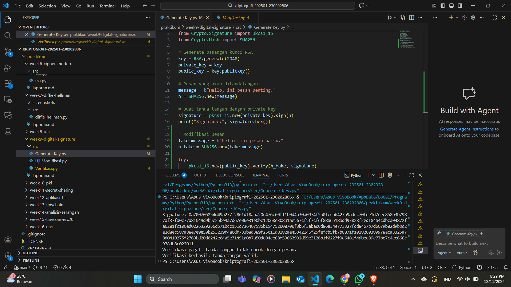

# Laporan Praktikum Kriptografi
Minggu ke-: 9  
Topik: Digital Signature (RSA/DSA)  
Nama: Exca Mutiara Nabilla  
NIM: 230202806  
Kelas: 5 IKRA  

---

## 1. Tujuan
Setelah mengikuti praktikum ini, mahasiswa diharapkan mampu:
Mengimplementasikan tanda tangan digital menggunakan algoritma RSA/DSA.
Memverifikasi keaslian tanda tangan digital.
Menjelaskan manfaat tanda tangan digital dalam otentikasi pesan dan integritas data.

---

## 2. Dasar Teori
Digital Signature adalah teknik kriptografi untuk memastikan keaslian, integritas, dan non-repudiation suatu pesan. Prosesnya menggunakan private key untuk membuat tanda tangan digital dan public key untuk memverifikasinya. Pesan biasanya di-hash terlebih dahulu agar proses lebih cepat dan aman.

Dalam RSA, tanda tangan dibuat dengan mengenkripsi hash menggunakan private key, lalu diverifikasi dengan public key. Pada DSA, tanda tangan dihasilkan melalui operasi logaritma diskrit dan membutuhkan nonce acak setiap penandatanganan agar aman.

Perbedaannya, RSA dapat dipakai untuk enkripsi maupun tanda tangan, sedangkan DSA khusus untuk digital signature. RSA umumnya lebih cepat pada verifikasi, sementara DSA lebih cepat saat proses penandatanganan.

---

## 3. Source Code
1. Generate Key dan Buat Tanda Tangan
```python
from Crypto.PublicKey import RSA
from Crypto.Signature import pkcs1_15
from Crypto.Hash import SHA256

# Generate pasangan kunci RSA
key = RSA.generate(2048)
private_key = key
public_key = key.publickey()

# Pesan yang akan ditandatangani
message = b"Hello, ini pesan penting."
h = SHA256.new(message)

# Buat tanda tangan dengan private key
signature = pkcs1_15.new(private_key).sign(h)
print("Signature:", signature.hex())
```

2. Verifikasi Tanda Tangan
```python
try:
    pkcs1_15.new(public_key).verify(h, signature)
    print("Verifikasi berhasil: tanda tangan valid.")
except (ValueError, TypeError):
    print("Verifikasi gagal: tanda tangan tidak valid.")
```

2. Verifikasi Tanda Tangan
```python
# Modifikasi pesan
fake_message = b"Hello, ini pesan palsu."
h_fake = SHA256.new(fake_message)

try:
    pkcs1_15.new(public_key).verify(h_fake, signature)
    print("Verifikasi berhasil (seharusnya gagal).")
except (ValueError, TypeError):
    print("Verifikasi gagal: tanda tangan tidak cocok dengan pesan.")
```
---

## 4. Hasil dan Pembahasan

Hasil eksekusi program Digital Signature (RSA/DSA):


)

---

## 5. Jawaban Pertanyaan
(Jawab pertanyaan diskusi yang diberikan pada modul.  
- Pertanyaan 1: Perbedaan utama antara enkripsi RSA dan tanda tangan digital RSA

  Jawab : Enkripsi RSA: pengirim mengenkripsi pesan menggunakan public key penerima, dan hanya private key penerima yang bisa membuka pesan. Tujuannya menjaga kerahasiaan.
        Tanda tangan digital RSA: pengirim “menandatangani” pesan dengan private key miliknya, lalu penerima memverifikasi menggunakan public key pengirim. Tujuannya memastikan integritas, keaslian, dan non-repudiation, bukan kerahasiaan.
- Pertanyaan 2: Mengapa tanda tangan digital menjamin integritas dan otentikasi pesan?
    Jawab : Integritas terjamin karena yang ditandatangani bukan pesan utuh, tetapi hash pesan; jika isi pesan berubah sedikit saja, hash berubah total dan verifikasi gagal.
    Otentikasi terjamin karena hanya pemilik private key yang dapat membuat tanda tangan yang valid. Jika tanda tangan cocok dengan public key tertentu, berarti pesan benar berasal dari pemilik kunci tersebut.
 - Pertanyaan 3: Peran Certificate Authority (CA) dalam sistem tanda tangan digital modern
    Jawab : CA bertindak sebagai pihak ketiga tepercaya yang memverifikasi identitas pemilik public key dan menerbitkan sertifikat digital.
    Dengan sertifikat dari CA, penerima dapat yakin bahwa public key benar-benar milik pihak yang sah, sehingga mencegah pemalsuan identitas dan serangan man-in-the-middle. 
)
---

## 6. Kesimpulan
Percobaan menunjukkan bahwa tanda tangan digital RSA mampu memastikan integritas dan otentikasi pesan melalui proses hashing dan verifikasi kunci publik. Hasil verifikasi membuktikan bahwa perubahan kecil pada pesan membuat tanda tangan tidak valid. Dengan demikian, mekanisme ini efektif untuk menjamin keaslian dan keamanan komunikasi digital.

---

## 10. Commit Log
```
commit week9-digital-signature
Author: exca <excaamn@gmail.com>
Date:   2025-12-09

    week9-digital-signature Digital Signature (RSA/DSA)
```
